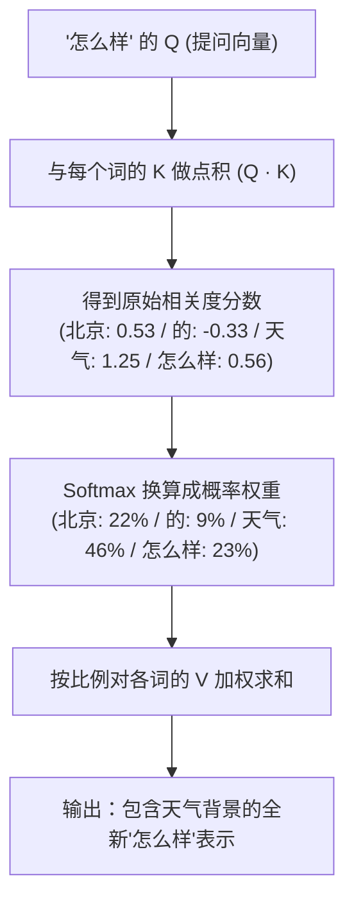
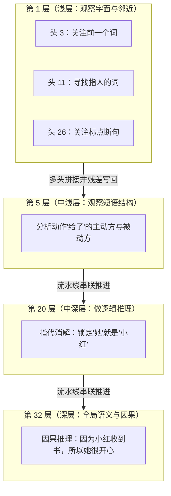

# 别再硬啃公式了：用“北京的天气怎么样”，零基础拆透 Transformer 注意力机制

> **导读**：当你在大模型里输入“北京的天气怎么样”时，模型在读到“怎么样”这一瞬间，究竟是如何精准看向“天气”，而不是把注意力浪费在“北京”或“的”上面的？
> 
> 很多人被 $Q, K, V$ 矩阵、多头注意力、Softmax、残差连接等层出不穷的公式劝退。本文剥离晦涩的高等数学，用**小学加减乘除 + 极简生活类比**，带你从零构建一套关于 Transformer 注意力机制（Self-Attention）的直观心智模型。
> 
> 文中所有数字均来自可交互、可手算的开源可视化项目，文末附完整交互演练。

---

## 一、大模型到底在干嘛？

在理解任何技术细节之前，首先记住一件事：

> **所有现代自回归语言模型（如 GPT、LLaMA、DeepSeek）本质上只在做一件事：根据前面的文字，预测下一个词（Token）。**

比如输入：`北京 的 天气 怎么样`，模型的任务是预测紧接着的下一个符号（比如一个问号 `？` 或回答）。

为了准确预测下一个词，模型读到句末的词（比如“怎么样”）时，**绝不能孤立地看它自己**，而必须**向句子前面的所有词打听背景信息**。

* 如果打听到了“天气”，它就知道当前在询问某种**气象状态**；
* 如果打听到了“北京”，它才知道讨论的**地理主体**；
* 如果只看“怎么样”自己，它就是个毫无上下文的空壳。

那么，**“打听信息”在数学上到底是怎么发生的？** 这就是 Transformer 核心组件 —— **注意力机制（Attention）** 的舞台。

---

## 二、为什么一个词需要三个“分身”？（Q、K、V 的真面目）

在注意力机制中，最让初学者困惑的就是三个字母：**$Q$ (Query)、$K$ (Key)、$V$ (Value)**。

为什么要大费周章地把一个词拆成三个向量？我们用一个经典的**“图书馆借书”**（或职场招聘）类比：

```
                    ┌──► Q (Query·提问)  ─── 我需要什么？（借书需求 / 岗位要求）
词向量 (Embedding) ──┼──► K (Key·标签)    ─── 我是什么？（图书标签 / 候选人简历）
                    └──► V (Value·内容)  ─── 我能提供什么？（书中正文 / 真实技能）
```

* **$Q$（Query · 提问需求）**：当前词发出的检索意图。
  * *“怎么样”发出提问：“谁能提供具体的状态或属性信息？”*
* **$K$（Key · 标签名片）**：每个词对外展示的检索索引。
  * *“北京”的名片写着：`[地点/实体]`*
  * *“天气”的名片写着：`[气象/状态]`*
  * *“的”的名片写着：`[虚词/连接]`*
* **$V$（Value · 实质内容）**：每个词真正包含的丰富语义信息。

### 为什么不能“一个向量用到底”？
很多初学者会问：“用一个词向量直接互相打分不行吗？”

**不行！** 如果只用一个向量，词 A 对词 B 的打分，必定等于词 B 对词 A 的打分（点积对称性）。但在人类语言中，关系往往是**严重不对称**的：
* “吃”需要极其关注“苹果”（动词寻找动作承受者）；
* 但“苹果”并不一定非要关注“吃”（它可能在“苹果熟了”、“买苹果”中扮演独立名词）。

**$Q$ 和 $K$ 的分工，打破了这种对称性：$Q$ 代表主动提问， $K$ 代表被动应答。**

---

## 三、注意力计算三部曲（手算一遍就懂了）

假设句子经过分词为 4 个 token：`["北京", "的", "天气", "怎么样"]`。

现在以 **“怎么样”** 为主角，看看它是如何吸收整句话信息的：



### 第一步：点积打分（$Q \cdot K$）
“怎么样”拿着自己的 $Q$，去分别和句子里每一个词（包括它自己）的 $K$ 计算**点积**（对应位置相乘再相加）：

$$\text{Score} = Q_{\text{怎么样}} \cdot K_i$$

* 两个向量方向越接近（话题契合），点积得分越高；
* 话题不相干或反向，得分接近 0 甚至为负（比如虚词“的”得分为 $-0.33$）。

最终算出一组相关度分数：
$$\text{北京}: 0.53 \quad|\quad \text{的}: -0.33 \quad|\quad \text{天气}: 1.25 \quad|\quad \text{怎么样}: 0.56$$

### 第二步：Softmax 把分数变成“注意力权重”
这些原始分数有正有负，没办法直接用来分配比例。通过 **Softmax 函数**，把分数全部转化为**大于 0 且总和为 100% 的概率分布**：

* **“天气”** 分数最高 ($1.25$) $\rightarrow$ 分配到 **$46\%$** 的注意力；
* **“怎么样”** 自己 ($0.56$) $\rightarrow$ 分配到 **$23\%$**；
* **“北京”** ($0.53$) $\rightarrow$ 分配到 **$22\%$**；
* **“的”** 是虚词 ($-0.33$) $\rightarrow$ 仅分配到 **$9\%$**。

### 第三步：按权重合并 $V$（打包内容）
最后，按照算出来的百分比，把各个词的 $V$（内容向量）混合起来：

$$\text{最终表示} = 46\% \times V_{\text{天气}} + 22\% \times V_{\text{北京}} + 23\% \times V_{\text{怎么样}} + 9\% \times V_{\text{的}}$$

> **结果：** “怎么样”成功吸收了 $46\%$ 的天气信息和 $22\%$ 的北京信息，从一个单纯的疑问代词，蜕变成了**“带着北京气象背景的提问”**！

---

## 四、升维进阶：什么是“多头”与“多层”？

刚才讲完的这一套流程，其实只是**单个注意力头在单层中**的一轮计算。

真实的大模型（例如 LLaMA-7B 拥有 32 层、每层 32 个头）会在**广度（头）**和**深度（层）**两个维度矩阵式重复：



### 1. 多头注意力（Multi-Head · 广度 · 并联）
* **为什么需要多头？**
  一组 $W_q, W_k, W_v$ 矩阵就像一个提问角度。一句话里既有主谓关系、又有修饰关系、还有指代关系，单靠一个头根本忙不过来。
* **做法：**
  模型派出 **32 个头（32 位专家）在同一时刻并行观察**。算完后把 32 份结果拼接（Concat）并融合，形成全景视角。

> 💡 **有趣的小细节：为什么浅层不同头会关注同一个词？**
> 
> 在例句 `小明 把 书 给了 小红 ， 她 很 开心` 中，追踪“她”时：
> * **头 3（看上一个词）** 最关注逗号 `，`；
> * **头 26（看标点断句）** 也最关注逗号 `，`。
> 
> **看似巧合，动机迥异**：头 3 是“近视眼”，纯粹因为逗号排在“她”正前方；头 26 则是“语法侦探”，它在全局搜寻标点，以此感知前半分句已经结束，后半句是全新的开始。

### 2. 多层堆叠（Multi-Layer · 深度 · 串联）
* **为什么需要多层？**
  单看一遍只能得到表层信息。Transformer 采用 **流水线式的逐层递进**：
  * **浅层（第 1 层）**：感知字面信息（“‘她’是代词，前面有人名，前有逗号”）；
  * **中层（第 5~20 层）**：建立逻辑联系与指代消解（“‘给了’涉及两个人，这里的‘她’指代小红”）；
  * **深层（第 32 层）**：形成全局因果与抽象意图（“小红因收到书而开心”）；

每层的多头计算完毕后，新信息会通过**残差连接（Residual Connection）**叠加写回词向量，然后作为下一层的输入继续推敲。

---

## 五、总结与一分钟记忆口诀

回看整个 Transformer 注意力机制，其实可以用一首极简口诀概括：

| 核心组件 | 核心口诀 | 通俗心智模型 |
| :--- | :--- | :--- |
| **Q · K · V** | **Q 提需求，K 做名片，V 存内容** | 检索借书 / 职场招聘 / 相亲匹配 |
| **打分与权重** | **点积算匹配分，Softmax 换成百分比** | 衡量各词与当前需求契合程度 |
| **聚合输出** | **按百分比混合 V，写回原词变聪明** | 融合上下文特征的全新向量 |
| **多头机制** | **32 位专家同时从不同维度发问** | 并联广度（语法/指代/修饰） |
| **多层网络** | **32 轮流水线层层推敲递进** | 串联深度（字面 $\rightarrow$ 逻辑 $\rightarrow$ 因果） |

---

## 六、动手体验

本文对应的交互式开源项目：**[GitHub 仓库地址: transformer-theory-analysis]**

该项目具有以下特点：
1. **0 门槛纯前端单页设计**：无需 Python 环境，打开浏览器即可体验从分词到多头多层的每一步交互。
2. **数值完全同源可验算**：文中出现的每一个数值（如“天气”的 $1.25$ 分、$46\%$ 权重），均由底层统一矩阵严格推导，没有任何手工编造的假数据。
3. **支持互动推演**：支持手动调整单格权重观察注意力分布变化（`Training` 组件）、拆解矩阵逐行计算逻辑（`MatrixExplain`）、以及逐层切换观察“她”如何逐步锁定“小红”（`MultiHeadLayer`）。

---

*如果你觉得这篇文章对你有启发，欢迎点赞、收藏并在评论区交流探讨！*
