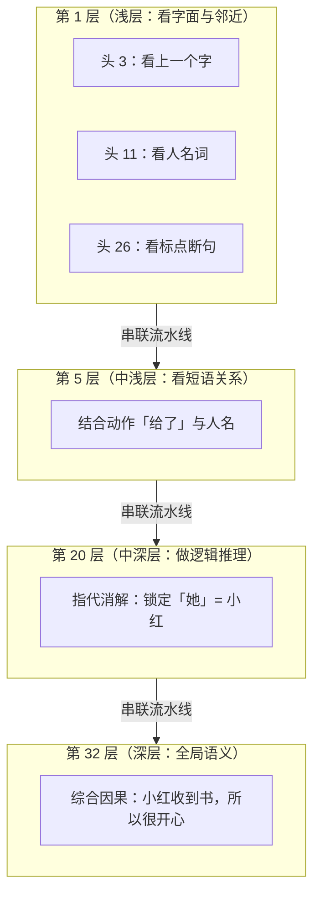

# Transformer & 注意力机制 · 1分钟极简速查指南

> 💡 **写在前面：** 适合隔段时间复习、或者不想从头啃公式与细节时快速建立直观心智模型。

---

## 一、模型的核心目标是什么？

* **本质：** 大模型只做一件事 —— **“预测下一个词”（接龙）**。
* **难点：** 要预测准确，当前词必须去**向句子里的其他词“打听背景信息”**。
  * *例：读到「北京 的 天气 怎么样」里的「怎么样」时，必须去向「天气」打听，才能知道要问的是气象状态，而不是地理位置。*

---

## 二、30 秒搞懂 Q、K、V（注意力打分机制）

每个词经过矩阵变换后，都会生成 3 个向量分身（类似图书馆借书或相亲匹配）：

| 向量 | 角色 | 通俗比喻 | 例子（以「怎么样」为例） |
| :--- | :--- | :--- | :--- |
| **Q** (Query) | **提问需求** | 借书人的检索关键词 / 择偶标准 | “我想打听谁能提供具体的状态/属性？” |
| **K** (Key) | **标签名片** | 图书封面的分类索引 / 个人名片 | 「北京」= [地点]，<br>「天气」= [状态/气象] |
| **V** (Value) | **实质内容** | 图书里的正文 / 真实的技能与内涵 | 每个词实际携带的丰富语义信息 |

### 核心计算两步走：
1. **点积打分 (Q · K) + Softmax：**
   * 用「怎么样」的 **Q** 去逐一与每个词的 **K** 碰一下（做点积）。
   * 结果与「天气」最匹配，经过 Softmax 换算后得出注意力权重：**天气 70%**、北京 20%、的 10%。
2. **按权重打包 V (加权求和)：**
   * 按比例提取各词的 **V**（70% 天气 + 20% 北京 + 10% 的）融合给「怎么样」。
   * **最终产物：** 「怎么样」吸纳了上下文，变成了**“携带天气背景的怎么样”**。

---

## 三、多头（Head）与多层（Layer）的区别

单个注意力头只是一次“单人、单轮”的调查。真实模型在**广度**和**深度**两个维度进行了放大：



### 1. 多头（Head · 广度 · 并联）
* **方式：** 32 个头在**同一时间并发计算**。
* **作用：** 解决“一个 Q 只能从单一维度提问”的局限。32 个专家同时从**语法、位置、代词指代、修饰关系**等 32 个角度发问，最后拼接（Concat）汇总。

### 2. 多层（Layer · 深度 · 串联）
* **方式：** 32 轮**流水线前后递进**。
* **作用：** 每一层把 32 个头的理解叠加写回原词（残差连接），送给下一层继续深挖，实现由浅入深的抽象推理。

---

## 四、典型疑问答疑

### Q: 为什么在第 1 层里，头 3 和头 26 都最关注逗号“ ，”？
> 例句：`小明 把 书 给了 小红 ， 她 很 开心`（当前追踪词为 **“她”**）

* **头 3（关注前一个词）：** 属于**局部位置驱动**。因为“她”的前一个词恰好就是“ ，”，所以它捕获了逗号。
* **头 26（关注标点与断句）：** 属于**句式结构驱动**。它在全局寻找标点符号，目的是识别“前一个分句在此结束，新分句开始了”。
* **结论：** 它们都看逗号只是**位置上的巧合**，背后的计算动机和提取的特征完全不同。

---

## 五、完整流水线 6 步记忆卡

```
第 1 步【分词】     句子切成 token（北京 / 的 / 天气 / 怎么样）
       ↓
第 2 步【Embedding】每个词转为初始数值向量
       ↓
第 3 步【生成 QKV】 词向量 × Wq/Wk/Wv → 获得提问、标签、内容三分身
       ↓
第 4 步【点积打分】 目标词的 Q · 各词的 K → 计算匹配程度
       ↓
第 5 步【Softmax】  把分数归一化为合计为 100% 的注意力比例
       ↓
第 6 步【加权求和】 按照注意力比例抽取各词的 V，叠加融合输出
```

> 🎯 **一句话口诀：**
> **Q 提问，K 匹配，V 拿数据；点积算分，加权融合；头负责多角度，层负责深推敲。**
